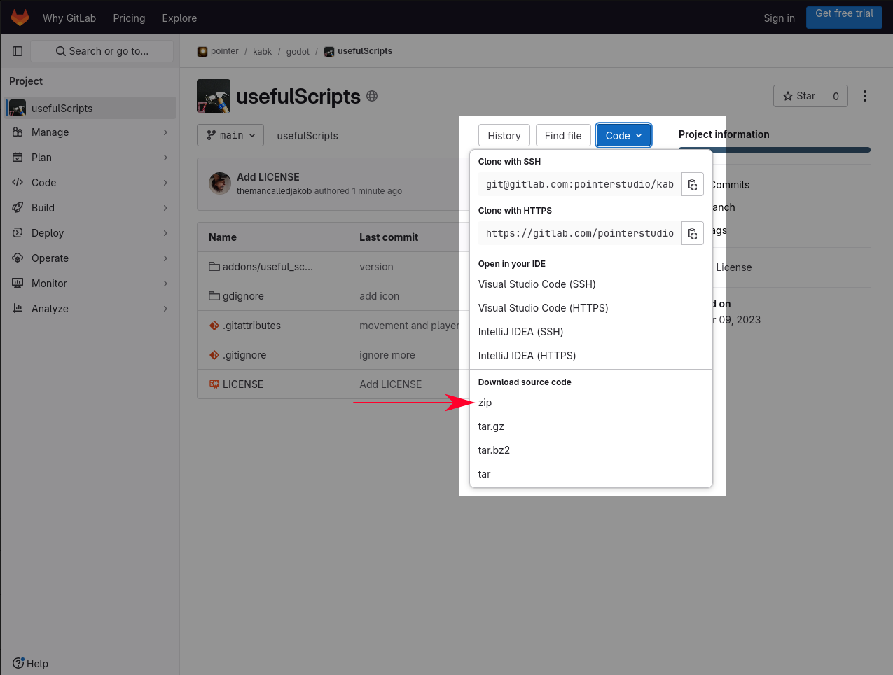
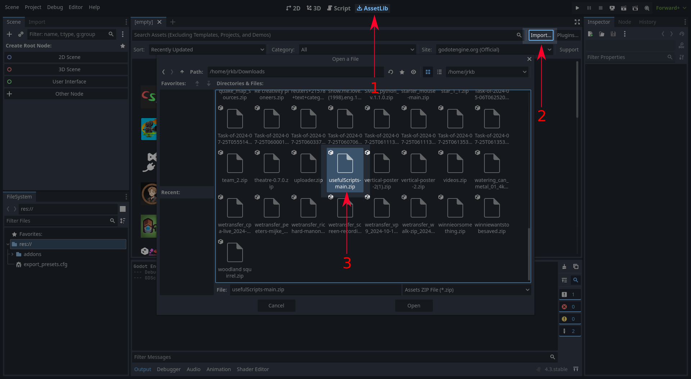
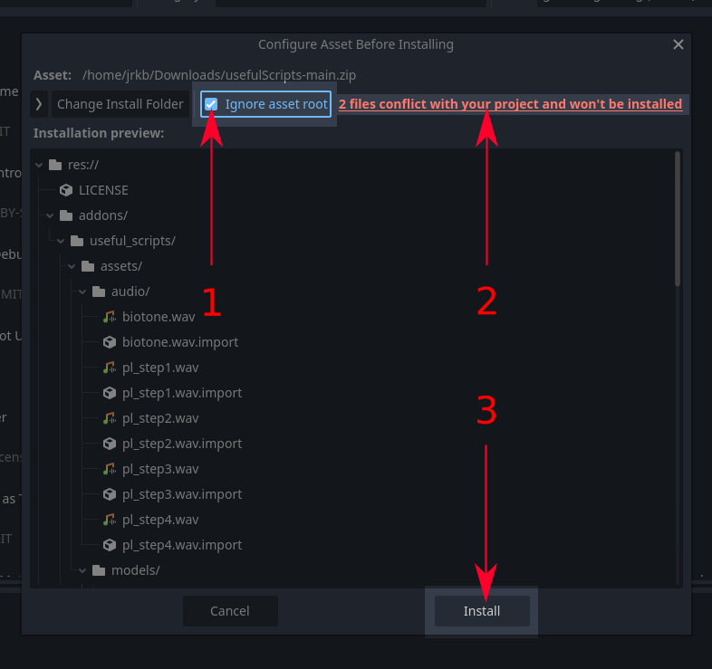
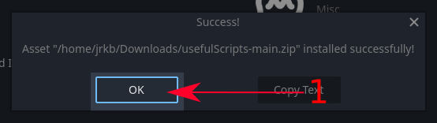
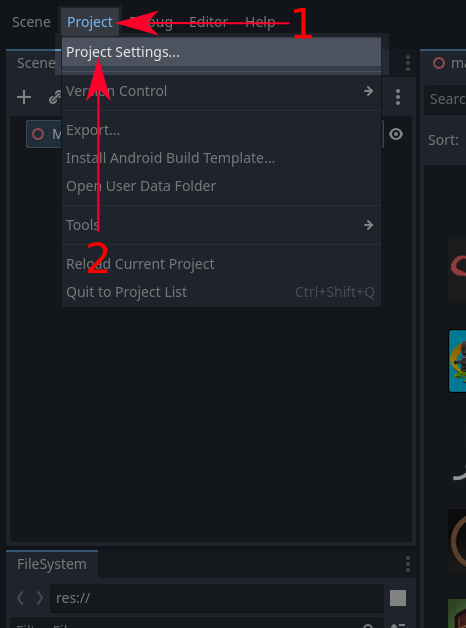
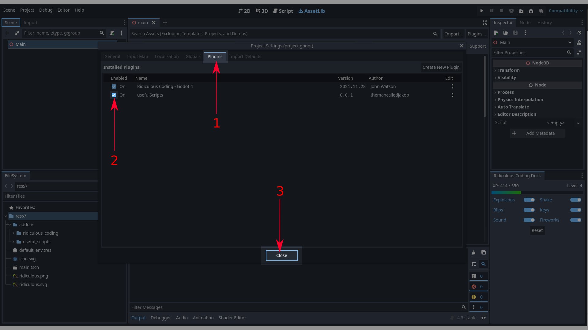
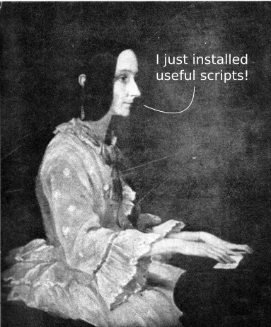

# Useful Scripts

A collection of hopefully useful scripts.

## Installation (manual)
Until the asset is in the online `AssetLib` of godot, we need to install it manually. Luckily someone made an instruction for us! It is not hard, however, every single step is important, so don't skip :) Anyways, here it is:

### 1. Download

1) Click on the blue `Code` button and courageously download the source code as a *zip*-file.

### 2. Import in Godot

1) Open the Asset Library by clicking on `AssetLib`
2) Click on `Import...` to Open a Filemanager
3) Select the downloaded zipfile
4) Open the file! So exciting :)

### 3. Configure Asset Before Installing

This needs to be done to get the correct file structure in your project.
The addon will partially still work if you don't do this. However, you want everything to work, right?

1) Click on `ignore asset root`
2) Ignore the scary warning that files are in conflict and won't be installed*
3) Click on `Install`, yes! We are getting there.

_*) This is safe to ignore, because the conflicting files are only useful for developing the addon itself. They have otherwise no function and it doesn't matter if they're installed or not._

### 4. Acknowledge premature success

1) Click on `OK` to show appreciation for the addon being successfully installed.

### 5. Activate the addon - Open Project Settings

1) Click on `Project` in the top bar to gently pull down the submenu.
2) Open `Project Settings`.

### 6. Activate the addon Part II

1) Open `Plugins`, which lists all installed plugins within this project.
2) Enable, activate and turn on our beautiful addon.
3) Finally, take a deep breath and close this window.

### 7. Done

*Congratulations!*

